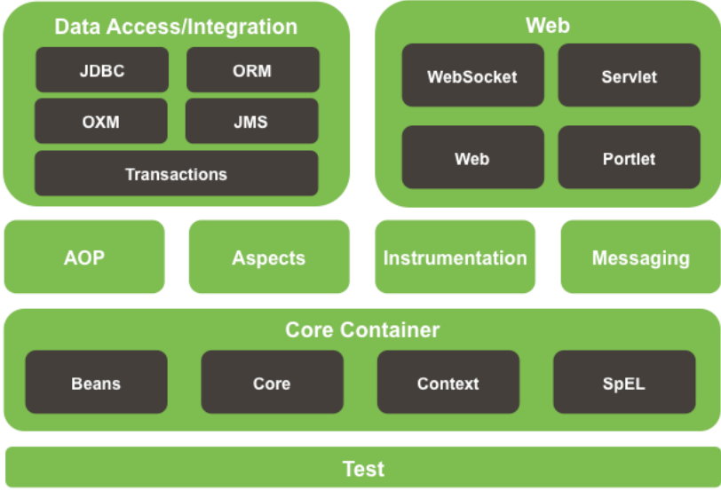

### Compatibitly
- JDK - 17
- Maven-3.9.8
- Spring Framework 6.0 Released
    - Requires Java 17+
- Fall 2022 - Spring Boot 3.0 Released
- Spring Framework 5.x 
    - Supports Java 8 - Java 17

### Spring vs Springboot

- Spring Framework is a collection of framework libraries
    - Dependency Injection, Web, Transaction Management, etc

    

- Spring Boot is automated tooling for Spring Framework applications
    - Think of it as a wrapper around Spring
    - You can use Spring Framework without Spring Boot
    - But you cannot use Spring Boot without Spring Framework

### Spring Boot Features:

- Curated “Starter” Dependencies for common components
- Sensible “Auto-Configuration” based on classes found on the classpath
    - For example, will auto-configure an in memory database if H2 is on the class path
- Externalized Configuration via files and environment variables
- Logging auto-configuration
- Performance Metrics
- Healthcheck endpoints
- Enhanced failure information 

### Spring Projects

- Spring Data - Collection of projects for persisting data to SQL and NoSQL databases
- Spring Cloud - Tools for distributed systems
- Spring Security - Authentication and Authorization
- Spring Session - Distributed web application sessions
- Spring Integration - Enterprise Integration Patterns
- Spring Batch - Batch processing
- Spring State Machine - Open Source State Machine

