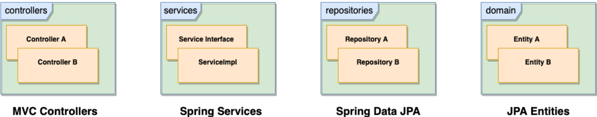

### Web Based Application

- Browser Communicates via HTTP on port 8080 (not default port which is 80)
- Tomcat is widely used as an application server for running Java web applications.
- Tomcat can serve Java Servlets and JSPs, which are server-side Java programs that generate dynamic web content.
- Tomcat Server Listens for Requests on port 8080
- Tomcat Routes Requests to Spring Boot Application
- Spring Boot Responds with HTML via HTTP

### how web app works 

- **Apache Tomcat + spring boot**

    

### how spring boot app works

- **Spring Boot**

    