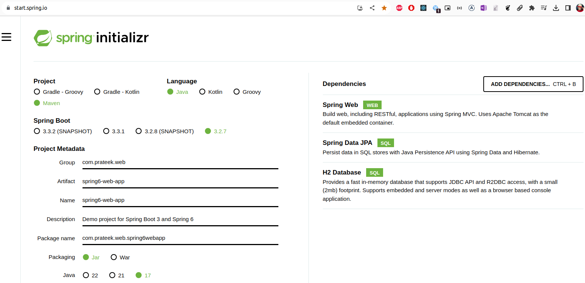

### Spring Initializer

- https://start.spring.io/
- Helps generate a maven project quickly 
- Easier to add dependencies as per need
- The scaffolded project has a maven wrapper

- Example Workflow

    - Run Maven Wrapper Command:

        ```bash
        ./mvnw clean install
        ```

    - Maven Wrapper Actions:

        - Checks if the required Maven version is already available.
        - Downloads the Maven version if it is not present.
        - Executes the Maven command (clean install in this case) using the specified Maven version.

    - Dependency Handling:

        - Maven, whether invoked by the wrapper or directly, handles dependencies by downloading them from remote repositories and storing them in the local repository (~/.m2/repository).


