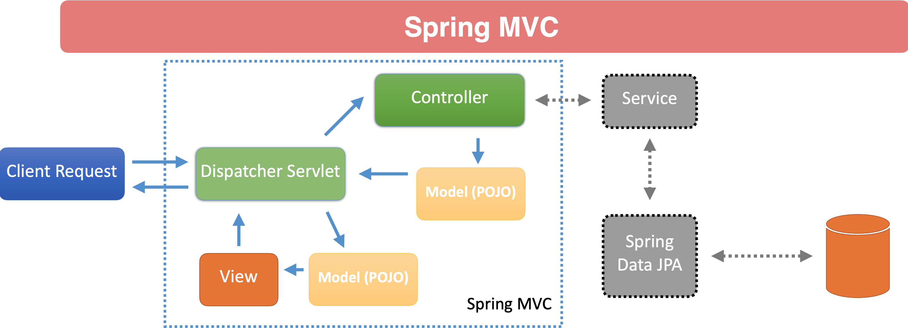

- MVC is a common design pattern for GUI and Web Applications and used in many programming languages

    - Model: 
        - Simple POJO with collection of properties which may or may not be used by the view
    
    - View: 
        - Data as requested by the client. 
        - Implemented with JSP, Thymeleaf, Jackson, etc. and can render HTML, JSON, XML, text, resp
    
    - Controller: 
        - Java class implemented to handle request mapping. 
        - Should be a “traffic cop” and contain minimal business logic. 
        - Typically works in conjunction with a service, which contains business logic.

    - Dispatcher Servelet:
        - The DispatcherServlet is the core of Spring MVC, responsible for managing the entire request lifecycle. 
        - It ensures that requests are directed to the appropriate controllers, manages the model and view resolution process, and handles exceptions, thereby serving as the central point of the web application.

Lifecycle of a Request in Spring MVC with DispatcherServlet:

- Incoming Request: An HTTP request is received by the web server and forwarded to the DispatcherServlet.

- Handler Mapping: The DispatcherServlet consults the handler mapping to find the appropriate controller to handle the request.

- Handler Execution: The found controller executes its corresponding handler method, processing the request.

- Model and View: The controller returns a ModelAndView object containing model data and view name.

- View Resolution: The DispatcherServlet uses the ViewResolver to resolve the view name to an actual view.

- View Rendering: The resolved view renders the model data to generate the final response, which is then sent back to the client.