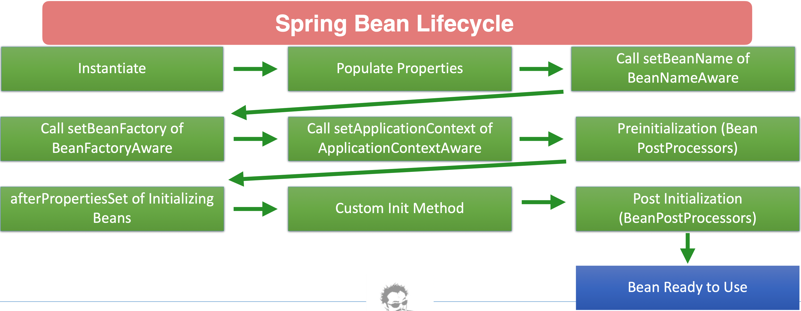
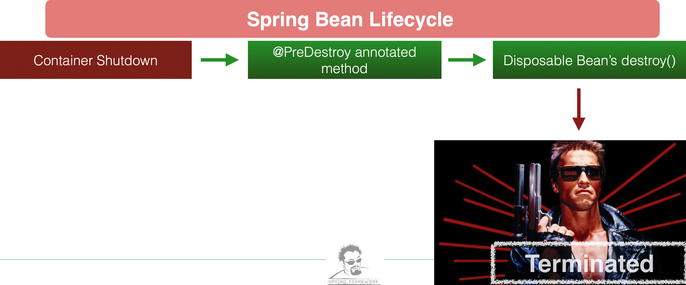

### Spring Bean Lifecycle





### Callback Interfaces

- Spring has two interfaces you can implement for call back events

- InitializingBean.afterPropertiesSet()
    - Called after properties are set
- DisposableBean.destroy()
    - Called during bean destruction in shutdown

### Lifecycle Annotations

- Spring has two annotations you can use to hook into the bean life cycle
    
    - @PostConstruct annotated methods will be called after the bean has been constructed, but before its returned to the requesting object
    
    - @PreDestroy is called just before the bean is destroyed by the container

### Bean Post Processors

- Gives you a means to tap into the Spring context life cycle and interact with beans as they are processed

- Called for all beans in context

- Implement interface BeanPostProcessor

    - postProcessBeforeInitialization - Called before bean initialization method
    - postProcessAfterInitialization - Called after bean initialization


# ‘Aware’ Interfaces
|Aware Interface |Description|
|-----|------|
|ApplicationContextAware | Interface to be implemented by any object that wishes to be notified of the ApplicationContext that it runs in|
|ApplicationEventPublisherAware | Set the ApplicationEventPublisher that this object runs in|
|BeanClassLoaderAware| Callback that supplies the bean class loader to a bean instance|
|BeanFactoryAware| Callback that supplies the owning factory to a bean instance|
|BeanNameAware| Set the name of the bean in the bean factory that created this bean|
|BootstrapContextAware |Set the BootstrapContext that this object runs in|
|LoadTimeWeaverAware| Set the LoadTimeWeaver of this object’s containing ApplicationContext|
|MessageSourceAware| Set the MessageSource that this object runs in|
|NotificationPublisherAware| Set the NotificationPublisher instance for the current managed resource instance|
|PortletConfigAware| Set the PortletConfig this object runs in|
|PortletContextAware| Set the PortletContext that this object runs in|
|ResourceLoaderAware| Set the ResourceLoader that this object runs in|
|ServletConfigAware| Set the ServletConfig that this object runs in|
|ServletContextAware| Set the ServletContext that this object runs in|

### Spring Aware Interfaces
- Spring Framework provides several "Aware" interfaces that allow beans to interact with the Spring container in various ways. 
- These interfaces enable beans to be aware of their environment and receive information from the container. Here are the 14 Aware interfaces in Spring, along with their use cases:

- Here are detailed use cases for each of the Aware interfaces in Spring:

1. ApplicationContextAware

    - Use Case: Allows a bean to access the ApplicationContext that contains it. This is useful when a bean needs to interact with other beans or access resources from the Spring context. 
    - For example, a bean might need to publish events, access other beans, or retrieve application properties.

    Example:

    ```java
    public class MyBean implements ApplicationContextAware {
        private ApplicationContext applicationContext;

        @Override
        public void setApplicationContext(ApplicationContext applicationContext) {
            this.applicationContext = applicationContext;
        }

        public void doSomething() {
            MyOtherBean otherBean = applicationContext.getBean(MyOtherBean.class);
            // Use otherBean for some purpose
        }
    }
    ```

2. ApplicationEventPublisherAware

    - Use Case: Allows a bean to access the ApplicationEventPublisher, which is used to publish events to the Spring context. This is useful for beans that need to trigger or respond to application events.

    - Example:

    ```java
    public class MyEventPublisher implements ApplicationEventPublisherAware {
        private ApplicationEventPublisher eventPublisher;

        @Override
        public void setApplicationEventPublisher(ApplicationEventPublisher eventPublisher) {
            this.eventPublisher = eventPublisher;
        }

        public void publishEvent(String message) {
            eventPublisher.publishEvent(new CustomEvent(this, message));
        }
    }
    ```

3. BeanClassLoaderAware

    - Use Case: Allows a bean to be aware of the BeanClassLoader. Useful when a bean needs to perform class loading or reflection operations using the class loader provided by Spring.

    - Example:

    ```java
    public class MyClassLoaderAwareBean implements BeanClassLoaderAware {
        private ClassLoader classLoader;

        @Override
        public void setBeanClassLoader(ClassLoader classLoader) {
            this.classLoader = classLoader;
        }

        public void loadClass(String className) throws ClassNotFoundException {
            Class<?> clazz = classLoader.loadClass(className);
            // Use clazz for some purpose
        }
    }
    ```

4. BeanFactoryAware

    - Use Case: Allows a bean to access the BeanFactory that created it. Useful for beans that need to look up other beans or create beans dynamically.

    - Example:

    ```java
    public class ServiceLocator implements BeanFactoryAware {
        private BeanFactory beanFactory;

        @Override
        public void setBeanFactory(BeanFactory beanFactory) {
            this.beanFactory = beanFactory;
        }

        public Object getService(String serviceName) {
            return beanFactory.getBean(serviceName);
        }
    }
    ```

5. BeanNameAware

    - Use Case: Allows a bean to be aware of its own name as defined in the Spring configuration. Useful for logging, debugging, or when a bean needs to know its own name for processing.

    - Example:

    ```java
    public class MyBean implements BeanNameAware {
        private String beanName;

        @Override
        public void setBeanName(String name) {
            this.beanName = name;
            System.out.println("Bean name is: " + name);
        }
    }
    ```

6. BootstrapContextAware

    - Use Case: Allows a bean to be aware of the BootstrapContext. This interface is more relevant for advanced scenarios involving the Spring Boot startup process and is used internally by Spring Boot.

    - Example: Typically not used in application-level code; it is more relevant for Spring Boot internals.

7. LoadTimeWeaverAware

    - Use Case: Allows a bean to access the LoadTimeWeaver, which is used for load-time weaving in aspect-oriented programming (AOP). Useful when using aspects and needing to perform weaving operations.

    - Example:

    ```java
    public class MyLoadTimeWeaverAwareBean implements LoadTimeWeaverAware {
        private LoadTimeWeaver loadTimeWeaver;

        @Override
        public void setLoadTimeWeaver(LoadTimeWeaver loadTimeWeaver) {
            this.loadTimeWeaver = loadTimeWeaver;
        }

        public void performWeaving() {
            // Use loadTimeWeaver to perform weaving
        }
    }
    ```

8. MessageSourceAware

    - Use Case: Allows a bean to access the MessageSource for resolving messages and handling internationalization (i18n). Useful for beans that need to fetch localized messages.

    - Example:

    ```java
    public class MessageService implements MessageSourceAware {
        private MessageSource messageSource;

        @Override
        public void setMessageSource(MessageSource messageSource) {
            this.messageSource = messageSource;
        }

        public String getMessage(String code) {
            return messageSource.getMessage(code, null, Locale.getDefault());
        }
    }
    ```

9. NotificationPublisherAware

    - Use Case: Allows a bean to be aware of the NotificationPublisher. This is more common in Java EE environments and is used for publishing notifications or messages.

    - Example: Typically used in Java EE environments, not commonly in Spring applications.

10. PortletConfigAware

    - Use Case: Allows a bean to access the PortletConfig in a portlet-based application. Useful for portlet applications where beans need to interact with portlet configuration.

    - Example:

    ```java
    public class MyPortletConfigAwareBean implements PortletConfigAware {
        private PortletConfig portletConfig;

        @Override
        public void setPortletConfig(PortletConfig portletConfig) {
            this.portletConfig = portletConfig;
        }

        public void doSomething() {
            String initParameter = portletConfig.getInitParameter("myParam");
            // Use initParameter for some purpose
        }
    }
    ```

11. PortletContextAware

    - Use Case: Allows a bean to access the PortletContext in a portlet-based application. Useful for beans that need to interact with the portlet context.

    - Example:

    ```java
    public class MyPortletContextAwareBean implements PortletContextAware {
        private PortletContext portletContext;

        @Override
        public void setPortletContext(PortletContext portletContext) {
            this.portletContext = portletContext;
        }

        public void doSomething() {
            String contextPath = portletContext.getContextPath();
            // Use contextPath for some purpose
        }
    }
    ```
12. ResourceLoaderAware

    - Use Case: Allows a bean to access the ResourceLoader for loading resources from various sources such as classpath, file system, etc. Useful for beans that need to load resources dynamically.

    - Example:

    ```java
    public class ResourceLoaderService implements ResourceLoaderAware {
        private ResourceLoader resourceLoader;

        @Override
        public void setResourceLoader(ResourceLoader resourceLoader) {
            this.resourceLoader = resourceLoader;
        }

        public Resource loadResource(String location) {
            return resourceLoader.getResource(location);
        }
    }
    ```

13. ServletConfigAware
    - Use Case: Allows a bean to access the ServletConfig in a servlet-based application. Useful for servlets or beans that need to interact with servlet configuration.

    - Example:

    ```java
    public class MyServletConfigAwareBean implements ServletConfigAware {
        private ServletConfig servletConfig;

        @Override
        public void setServletConfig(ServletConfig servletConfig) {
            this.servletConfig = servletConfig;
        }

        public void doSomething() {
            String initParameter = servletConfig.getInitParameter("myParam");
            // Use initParameter for some purpose
        }
    }
    ```
14. ServletContextAware

    - Use Case: Allows a bean to access the ServletContext in a servlet-based application. Useful for beans that need to interact with the servlet context, such as accessing context-wide parameters or resources.

    - Example:

    ```java
    public class MyServletContextAwareBean implements ServletContextAware {
        private ServletContext servletContext;

        @Override
        public void setServletContext(ServletContext servletContext) {
            this.servletContext = servletContext;
        }

        public void doSomething() {
            String contextPath = servletContext.getContextPath();
            // Use contextPath for some purpose
        }
    }
    ```

- Each Aware interface allows a bean to interact with specific aspects of the Spring container or environment. 

- These interfaces provide hooks for advanced scenarios where beans need to:

    - Access and manipulate the Spring container (ApplicationContextAware, BeanFactoryAware).
    - Publish events or interact with the event system (ApplicationEventPublisherAware).
    - Access resources or configuration (ResourceLoaderAware, MessageSourceAware, ServletContextAware, etc.).
    - Interact with portlets or handle specific Java EE contexts (PortletConfigAware, PortletContextAware).

- These interfaces provide flexibility and control over how beans interact with the broader Spring ecosystem and application environment.