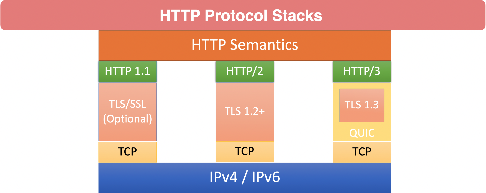

### Http Protocol

### Http Verbs / Request Methods

- Request methods, also known as verbs, are used to indicate the desired action to be performed

    - GET - is a request for a resource (html file, javascript file, image, etc)

        - GET - is used when you visit a website.

    - HEAD - is like GET, but only asks for meta information without the body. 

    - POST - is used to post data to the server.
    
        - POST is a create request
        
        - Typical use case for POST is to post form data to the server (like a checkout form)
    
    - PUT - is a request for the enclosed entity be stored at the supplied URI. 
        
        - PUT is a create OR update request
        
        - If the entity exists, it is expected to be updated.

    - DELETE - Is a request to delete the specified resource
    
    - TRACE - Will echo the received request. Can be used to see if request was altered by intermediate servers

    - OPTIONS - Returns the HTTP methods supported by the server for the specified URL

    - CONNECT - Converts the request to a transparent TCP/IP tunnel, typically for HTTPS through an unencrypted HTTP proxy
    
    - PATCH - Applies partial modifications to the specified resource
        
### Idempotence

- Idempotence - A quality of an action such that repetitions of the action have no further effect on the outcome

#### Idempotent Method

    - PUT and DELETE are Idempotent Methods

    - Safe Methods (GET, HEAD, TRACE, OPTIONS) are also Idempotent

    - Being truly Idempotent is not enforced by the protocol        

#### Non-Idempotent Method

    - POST is NOT Idempotent

    - Multiple Posts are likely to create multiple resources

    - Ever seen websites asking you to click submit only once?

### Spring Framework and RESTful Services

- The Spring Framework has very robust support for creating and consuming RESTFul Web Services

- Spring Framework has 3 Distinct web frameworks for creating RESTful services

    - Spring MVC is the oldest and most commonly used library for creating RESTful web services
        
        - Part of the core Spring Framework
        
        - Compatible with Java EE (Jakarta EE in Spring 6)
        
        - MVC - Model View Controller
        
        - Has robust support for traditional Web Applications
        
        - Based on traditional Java Servlet API
            
            - By nature this is blocking, non-reactive

    - Spring WebFlux was introduced with version 5 of the Spring Framework
        
        - WebFlux uses project Reactor to provide reactive web services
        
        - Does not use Java Servlet API, thus is non-blocking
        
        - Follows very closely to the configuration model of Spring MVC
        
        - Provides an easy transition for developers accustomed to traditional Spring MVC

    - WebFlux.fn - Web Framework introduced in Spring Framework 5
        
        - WebFlux.fn is a functional programming model used to define endpoints
        
        - Alternative to annotation based configuration
        
        - Designed to rapidly and simply define microservice endpoints

- Spring Framework has 2 Distinct web client for consuming RESTful services

    - RestTemplate is Spring’s primary library for consuming RESTFul web services
        
        - Very mature - been a part of Spring for a very long time
        
        - Highly configurable
        
        - As of Spring Framework 5 RestTemplate is in maintenance mode
        
        - No new features are planned
        
        - Step before deprecation, Spring recommends using WebClient for new development 

    - Spring WebClient was introduced in Spring Framework version 5
        
        - This is Spring’s reactive web client.
        
        - By default uses Reactor Netty, a non-blocking HTTP Client library