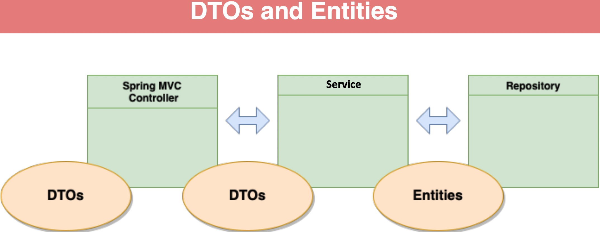

### Data Transfer Objects

- DTOs - Data Transfer Objects

- DTOs are simple Java POJOs

- DTOs are data structures, generally should NOT have behavior

- DTOs are objects used to transfer data between producers and consumers

- Controller models are typically DTOs

    

### Why Not use Entities as DTO

- Database Entities are also POJOs, why can’t we use those?

- For simple applications you can

- Spring Data REST exposes database entities directly

- Database entities can “leak” data to client tier

- As applications become more complex, having the separation becomes more important

- The needs of the consumers are different than the needs of persistence

- DTOs can be optimized for JSON serialization and deserialization 

### Type Conversions

- Type Conversions are often done within methods

- Best practice is to use dedicated converters

- Single Responsibility Principle

- Spring Framework provides an Interface called “Converter” with generics

- Can be used with conjunction with Conversion service

- MapStruct is a code generator which automates generation of type converters

### MapStruct

- MapStruct is a code generator

- You provide the interface, MapStruct generates the implementation

- Works like Lombok via annotation processing during code compile

- Has good Spring integration - can generate Spring Converters or Spring Components

- We will use Mapstruct Components for injection into services

- Link to MapStruct documentation in lecture resources