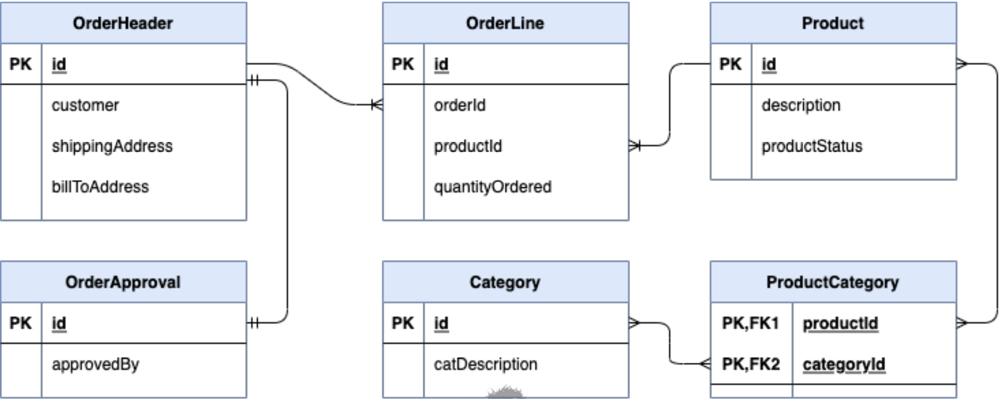
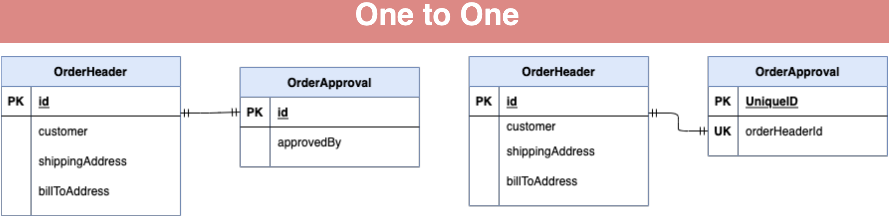
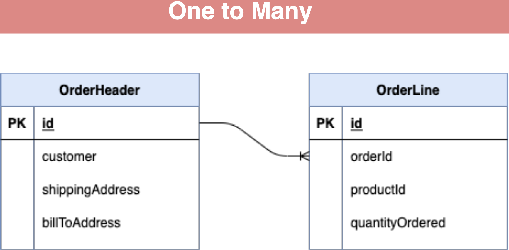
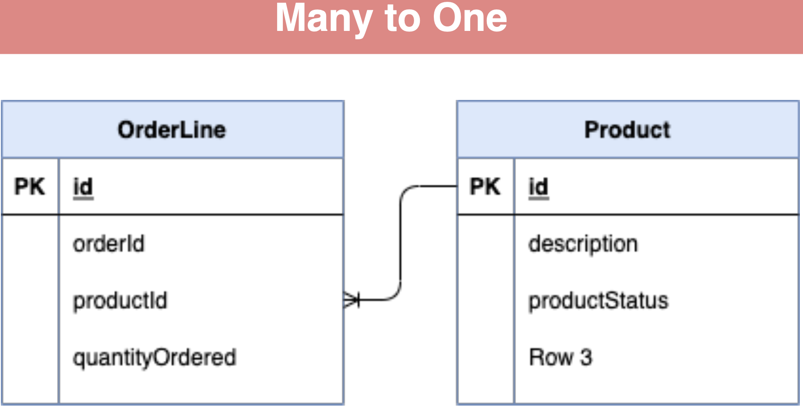
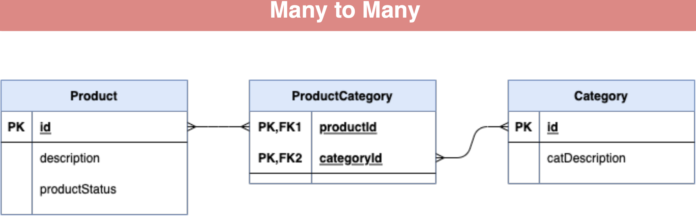

### Database Relationships

- One to One 
    
    - Both tables have only one record on each side of the relationship
    
    - Like an extension of the data row

- One to Many 
    
    - The primary table has one record that relates to zero or many records in the related table
    
    - An object with a list property

- Many to Many 

    - Each record in both tables may be related to zero or many records in the related table
    
    - Two lists, related to each other

### Database Constraints

- Best practice is to use database constraints to enforce relationships

    - One to One 

        - Both tables can share the primary key value, or one table can have its own primary key and unique key on id column of related table

        

    - One to Many 

        - The related table has column for primary key of primary table, with foreign key constraint

        

        

    -  Many to Many 

        - Join table is used with composite primary key consisting of the primary key values of related tables, with foreign key constraints 

        

### Relationship Direction

- Bi-Directional 

    - Relationship can be accessed from either side of the relationship
    
    - Example OrderHeader and OrderLine - likely needed from either side

- Uni-Directional 
    
    - Relationship can be access from either side of the relationship
    
    - Example OrderLine and Product 
    
        - Unlikely you will need to access Order Lines from Product
    
        - The Product entity does not have a reference to OrderLine

### Cascade Operations

- Hibernate has the ability to Cascade persistence operations
    
    - Example 
        
        - A delete of just Order Header would fail on foreign key constraints to OrderLine and OrderApproval

- Explicitly, you would need to perform deletes of the child records first

- Optionally, Hibernate can be configured to delete OrderLines and OrderApproval before deleting the OrderHeader

- Use with caution 

    - you would not wish to delete Product records on delete for OrderLine

### Foreign Key Declaration

- JPA does have a @ForeignKey annotation

- This is meta-data information only.

- Hibernate will reference this for schema generation only

- It is not enforced nor generated if missing

- When using schema migration tools like Liquibase or Flyway it is not needed