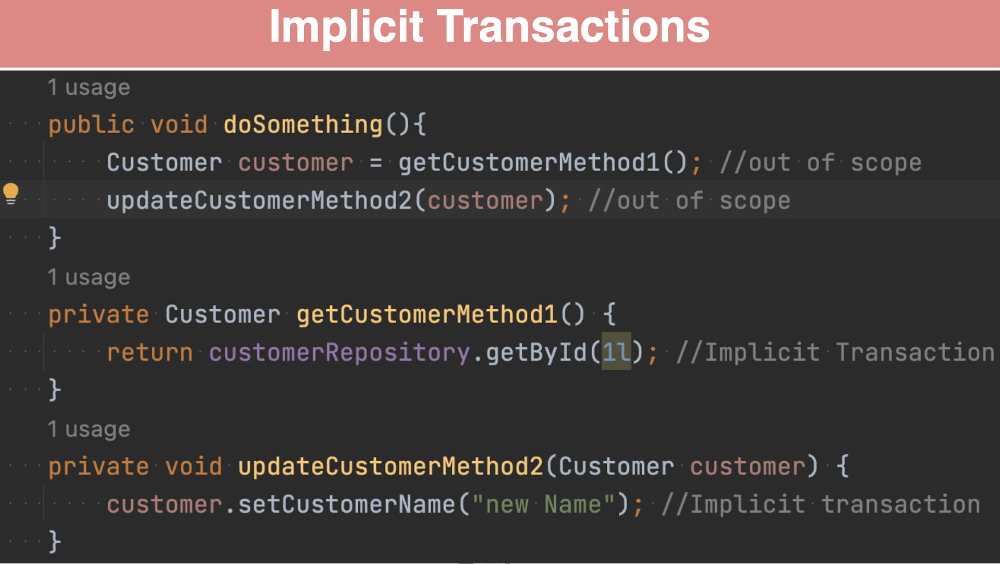
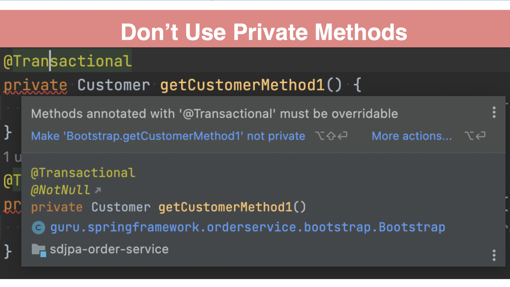
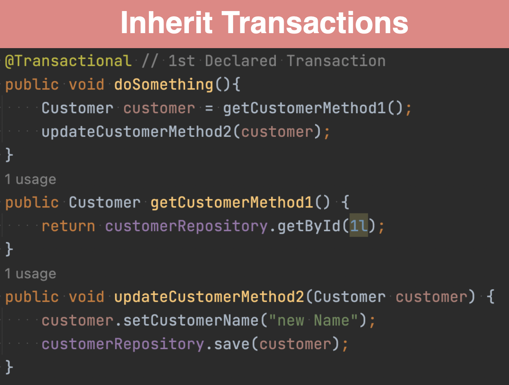
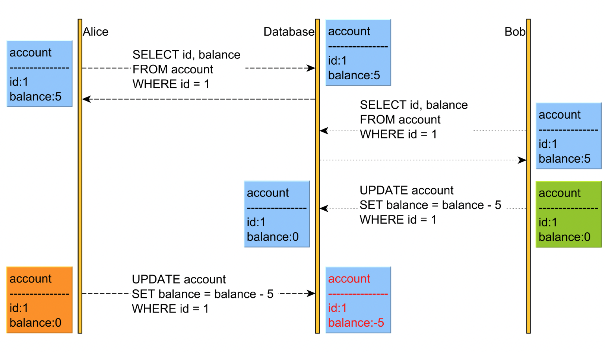

### SQL Database Transactions - ACID

- Atomicity - All operations are completed successfully or database is returned to previous state.

- Consistency - Operations do not violate system integrity constraints.

- Isolated - Results are independent of concurrent transactions.

- Durable - Results are made persistent in case of system failure (ie written to disk)


###  Transaction terms

- Transaction - A unit of work. One or more SQL operations
    
    - Typically DML (and Not DDL) statements which alter data.
    
    - Can be just one; can be hundreds or thousands.

- Commit - Indicates the end of the transaction and tells database to make changes permanent.
    
    - More efficient to do multiple operations in a transaction. There is a ‘cost’ with commits.

- Rollback - Revert all changes of the transaction

- Save Point - Programatic point you can set, which allows you to rollback to (ie rollback part of a transaction)


### Database Locks

- The database will lock the records, (in some cases whole table or database) to prevent other processes from changing data and ensure ACID compliance

- Within a transaction the following DML statements will lock records of the affected rows:
    
    - SELECT FOR UPDATE; UPDATE; DELETE; INSERT;

- During the transactions other sessions attempting to modify locked records will by default wait for the lock to be released. (ie interactively it will seem like things are hanging)

- Deadlock - Occurs where two transactions lock each other and can never complete.

    - Both fail and roll back.

### Transaction Isolation Levels (Depends on DB)

- Repeatable Read 

    - **Most Commonly used**
    
    - Default Isolation Level for MySQL and MariaDb. 
    
    - Your statement receives a consistent view of the database, even if other transactions are committed during your transaction.

    - Your transaction gets a snapshot of the data, which does not change.

- Read Committed - Reads within your transaction will receive a fresh snapshot of the data.

- Read Uncommitted - Reads are not consistent, but may avoid additional database locks.
    
    - aka - “Dirty Read”

- Serializable - Similar to Repeatable Read, but may lock rows selected in transaction

- From the least to the most consistent, there are four isolation levels:

    - READ UNCOMMITTED

    - READ COMMITTED (protecting against dirty reads)

    - REPEATABLE READ (protecting against dirty and non-repeatable reads)

    - SERIALIZABLE (protecting against dirty, non-repeatable reads and phantom reads)

- The default isolation level for transactions can vary between different database systems. Below is an overview of the default isolation levels for several popular database systems:

    |DB|DEFAULT ISOLATION LEVEL|
    |----|------|
    |MySQL, MariaDB|REPEATABLE READ|
    |PostgreSQL, Oracle, SQL Server, DB2, H2|READ COMMITTED|
    |SQLite|SERIALIZABLE|

### REPEATABLE READ vs READ COMMITTED

- Example Scenario

- Consider a banking application where you are reading an account balance multiple times within a transaction.

    - Read Committed Example:

        - Transaction T1 reads the balance of Account A: $1000.

        - Transaction T2 updates the balance of Account A to $800 and commits.

        - Transaction T1 reads the balance of Account A again: $800.

        - In READ COMMITTED, T1 sees the most recent committed balance of $800 after T2's update.

    - Repeatable Read Example:

        - Transaction T1 reads the balance of Account A: $1000.

        - Transaction T2 updates the balance of Account A to $800 and commits.

        - Transaction T1 reads the balance of Account A again: $1000.

        - In REPEATABLE READ, T1 sees the same balance of $1000 for both reads, even though T2 has committed a change to $800.

### Practical Tips for Isolation Level

- **Using the default transaction isolation level(***REPEATABLE_READ***), your transaction see’s a snapshot of the database as it is at the start of the transaction**.

    - **Changes made in other sessions and committed WILL NOT be visible**

    - **Changes made by your session WILL NOT be visible to other sessions until commit**

- Most modern RDBMS do a good job of ACID compliance

- Support for ACID with NoSQL database varies widely by vendor

- ACID compliance is complex and costly - hence high performance of NoSQL databases

### Spring Data JPA Transactions


#### implicit transactions:

- Spring Data JPA by default supports implicit transactions. 

- Meaning repository methods will create a transaction by default, if there is not an active transaction.

- Types of implicit transactions:

    

    - **Read operations are done in a read only context**

        - Use read only with caution, dirty checks are skipped, making more performant
            
            - the provider does not need to compare the current state of entities to their original state when the entity was read from db, thus reducing overhead and improving performance.

            - If object from read only context is updated and saved, you may encounter issues
    
    - **Updates and deletes are done with the default transactional context**

#### Spring Boot Testing Transactions

- Spring Boot by default will create a transaction for your tests and roll it back

- The Spring Data JPA Implicit transactions are NOT used in the test context

- Implicit transactions are only used outside of a transactional context

- If you have a method under test with one or more repository method calls, you may see different results when run outside of the test context

- Typically a detached entity error from accessing lazy load properties outside the Hibernate context


#### Spring JPA transaction

- Spring Framework provides an @Transactional annotation in the package “org.springframework.transaction.annotation”

- JEE also provides a @Transactional annotation in the package “javax.transaction”

- Recommended to use Spring Framework’s version of @Transactional
    
    - More versatile and Spring specific than JEE’s @Transactional

#### Transactional Annotation Attributes:

- **value / transactionManager** - the name of the Transaction Manager to use

    - Spring Boot will auto-configure an instance of a Transaction Manager depending on your dependencies

    - Spring Framework provides an interface called PlatformTransactionManager

    - Implementations available for JDBC, JTA (JEE), Hibernate, etc

    - Spring Boot auto-configures the appropriate implementation

    - Auto-Configured instance named ‘transactionManager'

- **label** - String to describe a transaction

- **Propagation** - The Transaction Propagation Type

    - REQUIRED - (Default) - use existing, or create new transaction

    - SUPPORTS - Use existing, or execute non-transactionally if none exists

    - MANDATORY - Support current, throw exception in none exists

    - REQUIRES_NEW - Create new, suspend current

    - NOT_SUPPORTED - Execute non-transactionally, suspend current transaction if exists

    - NEVER - Execute non-transactionally, throw exception if transaction exists

    - NESTED - Use nested transaction if transaction exists, create if not

- **Isolation** - Transaction Isolation Level

    - DEFAULT - (Default) Use level of JDBC connection

    - READ_UNCOMMITTED - Allows for dirty, no-repeatable reads

    - READ_COMMITTED - Prevent dirty reads, prevents from reading rows with uncommitted changes

    - REPEATABLE_READ - Prevent dirty reads and non-repeatable reads

    - SERIALIZABLE - prevent all dirty reads, similar to REPEATABLE_READ, and performs second read to verify

- **timeout** - Timeout for Transaction to complete

    - Default value is -1, which is to use the underlying implementation

    - Spring Boot does not override this

    - Unless set specifically at the connection level, defaults to the platform setting
        
        - For MySQL this is 8 hours

- **readOnly** - is read only?

    - By default the readOnly property is set to false

    - Spring Data JPA for implicate transactions of read methods will set this to true

    - Using the readOnly property to true does allow for Hibernate to make some efficiency optimizations

        - This is NOT guaranteed

    - DO NOT USE if you expect to update and save entities fetched 

- rollbackFor / rollbackforClassName - Exceptions to rollback for

    - By default unhandled runtime exceptions will be rollback

    - Typically default is fine for most situations

    - Can be useful where you wish to rollback a child transaction, but not the whole transaction

- NoRollbackFor / noRollbackforClassName - Exceptions to NOT rollback for

### Using @Transactional the correct way:


#### Use @Transactional on Repository

- Because there are more read operations than write ones, it’s good practice to define the @Transactional(readOnly = true) annotation on a per-class level.

- This way, by default, methods that are not annotated with @Transactional are going to be executed in the context of a read-only transaction, unless an existing read-write transaction has already been associated with the current processing Thread of execution.

- However, when we want to change the database state, we can use the @Transactional annotation to mark the read-write transactional method, and, in case no transaction has already been started and propagated to this method call, a read-write transaction context will be created for this method execution.

```java
    @Repository
    @Transactional(readOnly = true)
    public interface AccountRepository extends JpaRepository<Account, Long> {
    
        @Query(value = """
            SELECT balance
            FROM account
            WHERE iban = :iban
            """,
            nativeQuery = true)
        long getBalance(@Param("iban") String iban);
    
        @Query(value = """
            UPDATE account
            SET balance = balance + :cents
            WHERE iban = :iban
            """,
            nativeQuery = true)
        @Modifying
        @Transactional
        int addBalance(@Param("iban") String iban, @Param("cents") long cents);
    }
```

#### Use @Transactional on Service Layer methods

- The main goal of the Service Layer is to define the transaction boundaries of a given unit of work.

- If the service is meant to call several Repository methods, it’s very important to have a single transaction context spanning over the entire unit of work.

#### Dont Use Private Methods

- @Transactional annotation does not work on private methods



#### Add the annotatoion on the top most level 

- Dont do this since doSomething() which is not annotated with @Transactional calls the @Transactional annotated methods the Transaction Manager does not apply @Transaction on calling doSomething() this creates to separate transactions for the other methods

- Instead do this



### Lost Update Problem 

- The problem we have here is caused by the Lost Update anomaly, which is not prevented by the default isolation level of Oracle, SQL Server, PostgreSQL, or MySQL.




### Solution to Lost Update anomaly:

- #### Optimistic Locking

    - Done by checking a version attribute of the entity


- #### Pessimistic locking

    - Database mechanisms are used to lock records for updates

        - Capabilities vary widely depending on database and version of JDBC driver used
        
        - Simplest version is “SELECT FOR UPDATE…” - Locks row or rows until commit or rollback is issued 

- #### Stricter isolation level


### Which type of Locking to use when ?

- **Do You Need Locking?**

    - **Will your application have concurrent updates of the same records???**

#### Pessimistic Locking

- **Use if the data is frequently updated, and if updated concurrently**

- Remember, **there is a cost to performing the locking**

- Using pessimistic locks in Spring Data JPA ensures that a database row (or set of rows) is locked for the duration of a transaction (until committed or rollbacked ) to prevent other transactions from making changes to those rows. 

- This can be useful in scenarios where you need to ensure that no other transaction can modify or delete a row while it is being read or updated by the current transaction.

##### Types of Pessimistic Locks

- **PESSIMISTIC_READ** - uses shared lock, prevents data from being updated or deleted

- **PESSIMISTIC_WRITE** - uses exclusive lock, prevents data from being read (in some isolation levels), updated or deleted

- **PESSIMISTIC_FORCE_INCREMENT** - uses exclusive lock, increments version property of entity

- **Tips for using Locks**
    
    - **Most databases will support PESSIMISTIC_WRITE, this is the option you will typically use**

    - **Use PESSIMISTIC_FORCE_INCREMENT if entity has version property**

    - *JPARepository*

    ```java
        import org.springframework.data.jpa.repository.JpaRepository;
        import org.springframework.data.jpa.repository.Lock;
        import org.springframework.stereotype.Repository;

        // import javax.persistence.LockModeType; older version
        import jakarta.persistence.LockModeType;
        import java.util.Optional;

        @Repository
        public interface ProductRepository extends JpaRepository<Product, Long> {

            @Lock(LockModeType.PESSIMISTIC_FORCE_INCREMENT)
            Optional<Product> findById(Long id);

            @Lock(LockModeType.PESSIMISTIC_READ)
            Optional<Product> findById(Long id);

            @Lock(LockModeType.PESSIMISTIC_WRITE)
            Optional<Product> findProductById(Long id);
        }
    ```
    - *Service*

    ```java
        import org.springframework.beans.factory.annotation.Autowired;
        import org.springframework.stereotype.Service;
        import org.springframework.transaction.annotation.Transactional;

        @Service
        public class ProductService {

            @Autowired
            private ProductRepository productRepository;

            @Transactional
            public Product getProductWithPessimisticReadLock(Long id) {
                return productRepository.findById(id)
                        .orElseThrow(() -> new RuntimeException("Product not found"));
            }

            @Transactional
            public Product getProductWithPessimisticForceIncrementLockForWrite(Long id) {
                return productRepository.findById(id)
                        .orElseThrow(() -> new RuntimeException("Product not found"));
            }

            @Transactional
            public Product getProductWithPessimisticWriteLock(Long id) {
                return productRepository.findProductById(id)
                        .orElseThrow(() -> new RuntimeException("Product not found"));
            }
        }
    ```


#### Optimistic Locking

- **Use if the data is read more often than updated**

- **Majority of applications will use Optimistic Locking**

- Uses a version property, which is incremented with each update

- Can be int, Integer, long, Long, short, Short, or java.sql.Timestamp

- Most common to use is Integer

- Prior to an update, Hibernate will read the corresponding database record. 

- If the version does not match, an exception is thrown

- Downsides:

    - Updates outside of JPA/Hibernate which do not update the version property will break this

    - Performance - read before each update


#### Types of Pessimistic Locks

- OPTIMISTIC - Obtains optimistic read lock for all entities with version attribute

- OPTIMISTIC_FORCE_INCREMENT - Same at OPTIMISTIC, but in increments the version value

```java

    interface UserRepository extends Repository<User, Long> {

    // Plain query method
    @Lock(LockModeType.READ)
        List<User> findByLastname(String lastname);
    }

    interface UserRepository extends Repository<User, Long> {

    // Redeclaration of a CRUD method
    @Lock(LockModeType.READ)
        List<User> findAll();
    }
```


### Multi-Request Conversation - Occurs in web form applications, or possibly RESTful too,

- Where the update logic is over one or more requests, thus leaving a larger window of time.

- Pessimistic Locking is very fast, milliseconds. Will only protect against conflicts at write time.

- Optimistic Locking provides a mechanism to detect stale data over a longer period of time (ie - multiple requests). 


### Sources

https://vladmihalcea.com/spring-transaction-best-practices/

